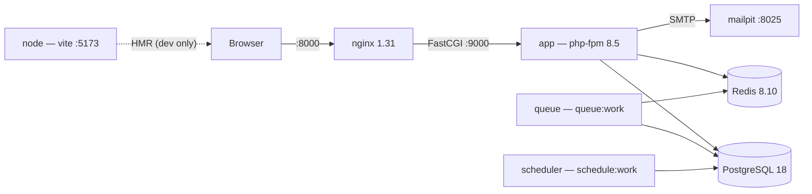
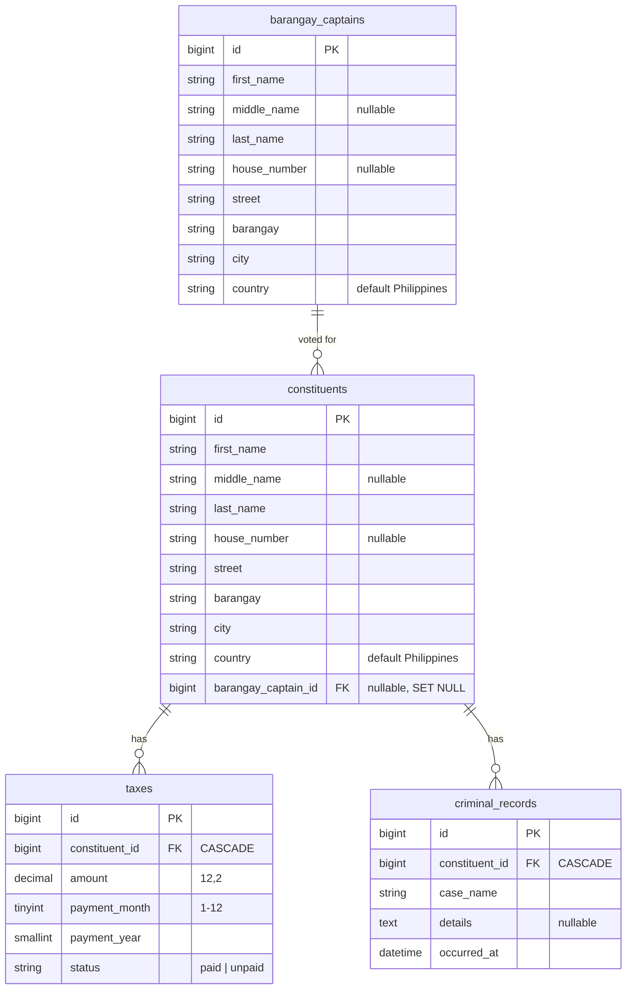

# Barangay Profiling System

A records system for a Philippine **barangay** (the smallest local government unit).
Barangay staff sign in and maintain a profile for every resident — who they are, where
they live, which barangay captain candidate they voted for, what they owe in local tax,
and whether they have a criminal record on file.

It started life in 2015 as a Laravel 5.1 prototype. This repository is that prototype
rebuilt on the current stack: Laravel 13 on PHP 8.5, PostgreSQL 18, and a Tailwind 4 front
end, all running in Docker.

---

## Contents

- [What it does](#what-it-does)
- [Tech stack](#tech-stack)
- [Container topology](#container-topology)
- [Quick start](#quick-start)
- [Everyday commands](#everyday-commands)
- [Domain model](#domain-model)
  - [Derived state, not stored flags](#derived-state-not-stored-flags)
  - [Structured addresses](#structured-addresses)
  - [Dashboard metrics](#dashboard-metrics)
- [How the CRUD is built](#how-the-crud-is-built)
- [Adding a new CRUD resource](#adding-a-new-crud-resource)
- [Testing](#testing)
- [Code quality](#code-quality)
- [Project layout](#project-layout)
- [What changed from the 2015 version](#what-changed-from-the-2015-version)
- [Running without Docker](#running-without-docker)
- [Troubleshooting](#troubleshooting)

---

## What it does

| Area | Capability |
|---|---|
| **Dashboard** | Landing page with headline figures and five charts: paid vs unpaid tax over the last 12 billing periods, tax records by status, outstanding tax by barangay, constituents by city, and votes per barangay captain. |
| **Authentication** | Email/password login with session fixation protection and per-email + IP login throttling. Self-service registration with **email verification**: the link is emailed on sign-up and the application stays closed until it is clicked. |
| **Constituents** | Full CRUD, paginated 15 to a page and searchable across every name and address column. Clicking a row opens the profile. |
| **Barangay captains** | Full CRUD for candidates, plus a paginated roster of the constituents who voted for each. |
| **Structured addresses** | House number (optional), street, barangay, city, and country are separate columns, so the data can be grouped and charted. |
| **Tax records** | Per-constituent monthly billing periods with a paid/unpaid status and an amount. One record per constituent per month. |
| **Criminal records** | Per-constituent case log with a timestamp and free-text details. |
| **Derived insight** | Each profile shows outstanding tax owed and whether the resident is tax-clear / record-clean. These are computed from the data, never stored. |
| **Profile** | Signed-in users update their own first / middle / last name and email. Changing the email re-sends the verification link and closes the app until it is clicked. |

### Seeded data

`php artisan migrate:fresh --seed` builds a realistic data set in about four seconds:
60 barangay captains, **3,200 constituents**, ~11,200 tax records, and ~950 criminal
records, spread unevenly across 26 cities and 20 barangays so the dashboard charts have
shape. Two accounts are created:

| Email | Password |
|---|---|
| `admin@brgy.local` | `password` |
| `test1@user.com` | `password112233` |

---

## Tech stack

Every component is on its current release, pinned explicitly.

| Layer | Choice | Version |
|---|---|---|
| Language | PHP | **8.5.10** |
| Framework | Laravel | **13.30** |
| Database | PostgreSQL | **18.6** |
| Web server | nginx | **1.31-alpine** |
| Cache / sessions / queue | Redis | **8.10-alpine** |
| CSS | Tailwind CSS | **4.3** |
| JS | Alpine.js | **3.17** |
| Charts | Chart.js | **4.5** |
| Bundler | Vite | **8.2** |
| Tests | Pest (on PHPUnit 13) | **5.1** |
| Static analysis | Larastan / PHPStan | **3.11**, level 6 |
| Formatter | Laravel Pint | **1.31** |
| Mail catcher (dev) | Mailpit | **1.31** |
| Node (build only) | Node LTS | **24-alpine** |

PostgreSQL **18** is the current major line. The application is PostgreSQL-only:
`pdo_mysql` is not compiled into the image and `config/database.php` defines just two
connections, `pgsql` and `sqlite`. The Pest suite passes on either.

---

## Container topology



| Service | Image | Role | Profile |
|---|---|---|---|
| `nginx` | `nginx:1.31-alpine` | Only published HTTP entrypoint; serves `public/`, proxies PHP over FastCGI | default |
| `app` | built from `Dockerfile` | php-fpm 8.5 running the application | default |
| `postgres` | `postgres:18-alpine` | Primary datastore; also hosts the `brgy_testing` database | default |
| `redis` | `redis:8.10-alpine` | Cache, sessions, queue backend | default |
| `queue` | same image as `app` | `queue:work` worker, drains jobs on SIGTERM | default |
| `scheduler` | same image as `app` | `schedule:work` long-running scheduler | default |
| `node` | `node:24-alpine` | Vite dev server with hot reload | `dev` |
| `mailpit` | `axllent/mailpit:v1.31` | Catches all outbound mail, web UI on `:8025` | `dev` |

`app`, `queue`, and `scheduler` share one YAML anchor (`x-app`) so their build, env, and
network configuration cannot drift apart.

The image is a four-stage build:

1. **`vendor`** — Composer install + optimized autoloader (production dependencies only).
2. **`assets`** — `npm ci` + `vite build` producing `public/build`.
3. **`app`** — `php:8.5.10-fpm-alpine` runtime with only the extensions the app uses
   (`pdo_pgsql`, `bcmath`, `intl`, `zip`, `pcntl`, `redis`; OPcache with tracing JIT is
   already built into the base image). Runs as the non-root `app` user, speaks FastCGI
   on 9000, and is the stage `compose.yaml` targets. Final image is ~156 MB.
4. **`render`** — the deployable artifact: the same runtime plus nginx and supervisord,
   answering HTTP on `$PORT` in one container. It is the final stage, so a bare
   `docker build .` produces it.

---

## Quick start

Requires Docker with Compose v2. Nothing else — no local PHP, PostgreSQL, or Node.

```bash
git clone <this-repo> brgy-project && cd brgy-project
make setup
```

`make setup` copies `.env.example` to `.env`, builds the images, installs dependencies,
boots the stack, generates `APP_KEY`, migrates, seeds, and builds the front-end bundle.

Then open **http://localhost:8000** — the dashboard — and sign in with either account:

| Email | Password |
|---|---|
| `admin@brgy.local` | `password` |
| `test1@user.com` | `password112233` |

Other endpoints:

- **http://localhost:8025** — Mailpit, every outbound email
- **http://localhost:8000/up** — health check
- `localhost:5432` — PostgreSQL, user `brgy` / password `secret`

Port collisions are resolved in `.env` (`APP_PORT`, `DB_PORT_FORWARD`,
`REDIS_PORT_FORWARD`, `VITE_PORT`, `MAILPIT_PORT`) without touching `compose.yaml`.

---

## Everyday commands

`make` with no target prints this list.

| Command | What it does |
|---|---|
| `make up` | Start everything including the `dev` profile, wait for health |
| `make down` | Stop and remove containers (volumes survive) |
| `make logs` | Tail every service |
| `make shell` | Bash in the `app` container as the `app` user |
| `make psql` | `psql` client inside the database container |
| `make migrate` | Run pending migrations |
| `make fresh` | Drop, re-migrate, re-seed |
| `make seed` | Re-run seeders |
| `make test` | Pest suite against `brgy_testing` |
| `make lint` | Fix code style with Pint |
| `make analyse` | PHPStan level 6 |
| `make assets` | Production front-end build |
| `make clean` | Remove containers, volumes, and local build artefacts |

Anything not wrapped by the Makefile runs through the container directly:

```bash
docker compose exec -u app app php artisan route:list
docker compose exec -u app app php artisan tinker
```

### Front-end development

`make up` starts the Vite dev server in the `node` container. While `public/hot` exists,
Blade's `@vite` directive loads assets from `http://localhost:5173` with hot reload, so
edits to `resources/css` and `resources/js` apply immediately. Run `make assets` for the
production bundle; delete `public/hot` to switch back to it.

---

## Domain model



Referential integrity lives in the database:

- Deleting a constituent **cascades** to their tax and criminal records.
- Deleting a captain **nulls** `constituents.barangay_captain_id`; residents are never
  deleted as a side effect.
- `taxes_period_unique` on `(constituent_id, payment_year, payment_month)` makes a
  duplicate billing period impossible. `TaxRequest` mirrors it as a readable validation
  message rather than letting the constraint surface as a 500.

### Derived state, not stored flags

The 2015 schema carried `constituent.has_record` and `constituent.has_unpaid_tax` as
booleans, and controllers called a `check_has_unpaid_tax()` helper to resync them after
every write. Any code path that forgot left the listing showing a lie.

Those columns are gone. `Constituent` exposes accessors instead:

```php
$constituent->has_unpaid_taxes;      // bool
$constituent->has_criminal_record;   // bool
$constituent->outstanding_tax_total; // float
```

Each accessor prefers an already-loaded relation, then an eager-loaded aggregate, and only
falls back to its own query when neither is present. The listing applies one scope:

```php
Constituent::query()->withListingAggregates()->search($term)->orderedByName()->paginate(15);
```

`withListingAggregates()` attaches the captain plus `withCount`/`withSum` subqueries, so a
15-row page with all three derived values costs **2 queries**, not 46. A test asserts that
query count so a future change cannot quietly reintroduce the N+1.

### Enum-backed status

`taxes.status` is backed by `App\Enums\TaxStatus` (`paid` / `unpaid`), which also owns its
display label and badge styling. Validation uses `Rule::enum(TaxStatus::class)`, so an
unknown status is rejected before it reaches the database.

### Structured addresses

The 2015 schema stored one free-text `address` column, so it was impossible to group
residents by city or validate anything. It is now five columns behind the
`App\Models\Concerns\HasAddress` trait, shared by `Constituent` and `BarangayCaptain`:

```php
$constituent->street_address; // "124-D Ilang-Ilang Street"  (street alone if no house number)
$constituent->full_address;   // "124-D Ilang-Ilang Street, Brgy. San Antonio, Pasig, Philippines"
```

`house_number` is the only optional part — rural and informal addresses frequently have
none. `country` defaults to `Philippines`. The search scope covers all five columns, so
"Caloocan" or "Bagong Silang" finds residents just like a name does, and the dashboard can
aggregate by `barangay` and `city` because they are real columns.

### Dashboard metrics

`App\Queries\DashboardMetrics` is a read model: every figure is a grouped aggregate, so the
landing page costs a fixed handful of queries no matter how many residents exist. A test
pins that — building the whole dashboard over 20 constituents with taxes and records stays
within 12 queries, and the count cannot grow with the row count.

The controller hands the view one plain array. `dashboard.blade.php` never touches the
database and contains no chart JavaScript: `<x-ui.chart type="line" :data="..." />` passes
its payload through `@js()` to an `Alpine.data('chart', ...)` factory registered once in
`resources/js/app.js`. Every chart falls back to an empty state when its dataset is empty,
so a freshly migrated database still renders.

---

## How the CRUD is built

Every resource follows the same Laravel-idiomatic path. Constituents, end to end:

**1. Route — a named resource, not seven hand-written lines**

```php
// routes/web.php
Route::resource('constituents', ConstituentController::class);
```

Nested resources use `->shallow()`, so `create`/`store` hang off the parent while
`edit`/`update`/`destroy` bind the child directly (`/constituents/5/taxes/create` to
create, `/taxes/31/edit` to edit):

```php
Route::resource('constituents.taxes', TaxController::class)
    ->shallow()
    ->except(['index', 'show']);
```

`php artisan route:list` is the source of truth for names.

**2. Controller — thin, typed, route-model bound**

Laravel resolves `{constituent}` into the model before the method runs; a missing id is a
404, never a null dereference.

```php
public function update(ConstituentRequest $request, Constituent $constituent): RedirectResponse
{
    $constituent->update($request->validated());

    return redirect()
        ->route('constituents.show', $constituent)
        ->with('status', 'Constituent updated.');
}
```

**3. Form request — validation lives outside the controller**

```php
class ConstituentRequest extends FormRequest
{
    public function rules(): array
    {
        return [
            'first_name' => ['required', 'string', 'max:80'],
            'middle_name' => ['nullable', 'string', 'max:80'],
            'last_name' => ['required', 'string', 'max:80'],
            'address' => ['required', 'string', 'max:255'],
            'barangay_captain_id' => ['nullable', 'integer', Rule::exists('barangay_captains', 'id')],
        ];
    }
}
```

One request class serves both `store` and `update` because the rules are genuinely
identical; splitting them would just duplicate the list. `TaxRequest` does differ between
verbs (its uniqueness rule must ignore the record being edited) and handles that in one
place with `->ignore($this->route('tax'))`.

Only `$request->validated()` reaches the model, and mass assignment is bounded by the
Laravel 13 `#[Fillable([...])]` attribute on each model — so an attacker cannot post extra
fields.

**4. Model — typed relations, casts, and scopes**

```php
#[Fillable(['constituent_id', 'amount', 'payment_month', 'payment_year', 'status'])]
class Tax extends Model
{
    protected function casts(): array
    {
        return [
            'amount' => 'decimal:2',
            'status' => TaxStatus::class,
        ];
    }

    #[Scope]
    protected function unpaid(Builder $query): void
    {
        $query->where('status', TaxStatus::Unpaid);
    }
}
```

`#[Scope]` is the Laravel 12+ replacement for the old `scopeUnpaid()` prefix convention.

**5. View — Blade components, not copy-pasted markup**

```blade
<x-layouts.app title="Constituents">
    <x-form.input name="first_name" label="First name" :value="$constituent->first_name" required />
    <x-ui.delete-button :action="route('constituents.destroy', $constituent)" :confirm="'Delete '.$constituent->full_name.'?'" />
</x-layouts.app>
```

Create and edit pages share a `_form.blade.php` partial. Form components read `old()`
themselves and render their own `@error` message, so no page repeats that wiring. Every
form emits `@csrf`, and non-POST verbs emit `@method('PUT')` / `@method('DELETE')`.

---

## Adding a new CRUD resource

Say you need **Business Permits** for a constituent.

```bash
make shell
```

```bash
# 1. Model, migration, factory, seeder, form request, resource controller — one command
php artisan make:model BusinessPermit -mfsc --requests

# 2. Fill in the migration: foreignId('constituent_id')->constrained()->cascadeOnDelete()
# 3. Declare #[Fillable([...])], casts(), and the belongsTo relation on the model
# 4. Write the rules in app/Http/Requests/StoreBusinessPermitRequest.php
# 5. Register the route
#      Route::resource('constituents.business-permits', BusinessPermitController::class)
#          ->shallow()->except(['index', 'show']);
# 6. Add views under resources/views/business-permits/ reusing <x-form.*> and <x-ui.*>
# 7. Write a Pest feature test per behaviour

php artisan migrate
exit
```

```bash
make test && make analyse && make lint
```

Conventions worth keeping:

- Table names are plural snake_case so Laravel infers them — no `$table` overrides.
- Timestamps end in `_at` and are cast to `datetime`.
- Never store a value you can derive; add a scope and an accessor instead.
- Put integrity rules in the migration **and** surface them as validation messages.
- Controllers return `View` or `RedirectResponse`; annotate every signature.

---

## Testing

```bash
make test
```

59 Pest feature tests, 253 assertions. They run against the real **PostgreSQL**
`brgy_testing` database (created automatically by
`docker/postgres/init/01-create-testing-database.sql`), not in-memory SQLite — the schema
depends on `ON DELETE CASCADE` and `ON DELETE SET NULL`, and those must be exercised on
the engine that runs in production. `RefreshDatabase` wraps each test in a transaction.

The suite also passes end to end on SQLite, which is a deliberate property rather than an
accident: it is the check that no engine-specific SQL has crept back in.

```bash
docker compose run --rm --no-deps -T -u app -e APP_ENV=testing \
  -e DB_CONNECTION=sqlite -e DB_DATABASE=:memory: -e CACHE_STORE=array \
  -e SESSION_DRIVER=array -e QUEUE_CONNECTION=sync -e BCRYPT_ROUNDS=4 \
  --entrypoint sh app -c 'php artisan test'
```

What is covered:

| File | Contract under test |
|---|---|
| `AuthenticationTest` | Guest redirect, login success/failure, lockout after 5 attempts, registration with name parts that lands on the verify page and sends the link, logout |
| `EmailVerificationTest` | The `verified` gate, the notice page, a valid signed link verifying, wrong hash / missing signature rejected, the signed-out → login → back-to-the-link round trip, resend and its no-op for verified users |
| `ConstituentCrudTest` | Listing, 15-per-page pagination, search across name *and* address columns, create, address accessors with and without a house number, validation rejection, update, delete cascading to child records |
| `BarangayCaptainCrudTest` | Create, validation, voter roster, roster pagination via `constituents_page`, constituent count, delete nulling the reference without deleting residents |
| `TaxRecordTest` | Nested route attaches to the right parent, duplicate period rejected, same period allowed for a different constituent, editing keeps its own period, month/status range checks |
| `CriminalRecordTest` | Nested create, future date rejected, shallow update/delete |
| `DerivedConstituentStateTest` | The derived flags agree with the rows in every load strategy, and the listing stays at 2 queries |
| `DashboardTest` | Every aggregate: totals, status split, the twelve monthly buckets and their window, barangay/city/captain rankings and their ordering, recent records, empty-database rendering, and a bounded query count |
| `ProfileTest` | Self-service update, optional middle name, email uniqueness, keeping your own email, verification reset + re-send when the email changes |

`tests/Pest.php` exposes an `asAdmin()` helper for acting as a signed-in administrator.

### Why `make test` passes explicit env vars

`phpunit.xml` declares `DB_DATABASE=brgy_testing`, `APP_ENV=testing` and friends with
`force="true"`. That is enough on a host, where those variables do not exist in the
process environment.

It is **not** enough inside the container. PHPUnit's `force` only rewrites `putenv()` and
`$_ENV`, while `Illuminate\Support\Env` reads `$_SERVER` first — and compose exports
`APP_ENV=local` and `DB_DATABASE=brgy` there for real. A plain
`docker compose exec app php artisan test` therefore used to run `RefreshDatabase`
against the **development** database (wiping it) and leave `APP_ENV=local` so CSRF
validation rejected every POST with a 419.

Two things prevent that now:

1. `make test` passes the overrides as real environment variables
   (`docker compose exec -e APP_ENV=testing -e DB_DATABASE=brgy_testing ...`), so
   `$_SERVER` carries the right values.
2. `Tests\TestCase` refuses to boot against any database other than `brgy_testing`,
   and it checks *before* `parent::setUp()` — because `RefreshDatabase` migrates from
   inside the parent, a later check would already have dropped the tables it protects.

So `make test` works, and a misconfigured invocation fails loudly instead of destroying
data.

---

## Code quality

```bash
make lint      # Pint, Laravel preset
make analyse   # PHPStan level 6 via Larastan — currently zero errors
```

`phpstan.neon` scopes analysis to `app`, `database`, and `routes`. `tests/` is excluded on
purpose: inside a Pest `it()` closure PHPStan resolves `$this` to `Pest\PendingCalls\TestCall`
rather than the bound `TestCase`, so every `$this->get(...)` is reported as an undefined
method. No shipped extension models that binding, and baselining ~40 false positives would
bury real findings.

---

## Project layout

```
app/
  Enums/TaxStatus.php              status + label + badge styling in one place
  Http/Controllers/                resource controllers, thin and typed
    Auth/                          login session + registration
    DashboardController.php        landing page
  Http/Requests/                   all validation
    Concerns/ValidatesAddress.php  shared address rules
  Models/
    Concerns/HasPersonName.php     full_name accessor + search/ordering scopes
    Concerns/HasAddress.php        street_address / full_address accessors
  Queries/DashboardMetrics.php     aggregate read model for the dashboard
database/
  migrations/                      Schema builder with real foreign keys
  factories/                       one per model; TaxFactory hands out unique periods
    Support/PhilippineAddress.php  curated PH street / barangay / city vocabulary
  seeders/                         DatabaseSeeder -> BarangaySeeder (chunked bulk inserts)
resources/
  css/app.css                      Tailwind 4 CSS-first theme
  js/app.js                        Alpine bootstrap + Chart.js defaults and factory
  views/
    dashboard.blade.php            stat cards + five charts
    components/layouts/            app (authenticated) + guest shells
    components/ui/                 alert, badge, button, card, chart, row-link, stat-card, ...
    components/form/               input, select, textarea, errors
    constituents/ barangay-captains/ taxes/ criminal-records/ profile/ auth/ errors/
docker/
  php/      php.ini, opcache.ini, www.conf, entrypoint.sh,
            supervisord.conf + render-fpm.conf + render-php.ini (deploy stage)
  nginx/    default.conf (dev vhost), render.conf.template (single-container twin)
  postgres/ init/01-create-testing-database.sql
routes/web.php                     every route, named
tests/Feature/                     Pest suite
Dockerfile  compose.yaml  Makefile
```

---

## What changed from the 2015 version

| Then (Laravel 5.1, 2015) | Now |
|---|---|
| PHP 5.5.9, Laravel 5.1 | PHP 8.5.10, Laravel 13.30 |
| `app/Http/routes.php`, ~40 hand-written routes | `routes/web.php`, named `Route::resource` with `->shallow()` nesting |
| `app/Http/Kernel.php`, `Console/Kernel.php`, 5 middleware classes | `bootstrap/app.php` |
| Models in `app/`, `$table` overrides, no types | `app/Models/`, conventional table names, typed relations, casts, `#[Fillable]` |
| `$input = $request->all()` assigned field by field in a `save_data()` helper | Form requests, `$request->validated()`, `Model::create`/`update` |
| `Constituent::find($id)` then use — 404s were null dereferences | Route-model binding |
| `has_record` / `has_unpaid_tax` columns resynced by hand | Derived accessors + aggregate scopes |
| Months stored as the string `'January'` | `payment_month` tinyint 1–12, sortable and comparable |
| `DB::statement('CREATE TABLE ...')` raw DDL | Schema builder, `constrained()->cascadeOnDelete()` |
| `amount DOUBLE` | `decimal(12,2)`, cast so money never round-trips a float |
| No uniqueness on tax periods | `taxes_period_unique` + a matching validation message |
| `AuthenticatesAndRegistersUsers` + `ThrottlesLogins` traits | Explicit auth controllers, `RateLimiter`, session regeneration |
| AdminLTE 2, Bootstrap 3, jQuery 2, DataTables, iCheck — 17 MB vendored into `public/` | Tailwind 4 + Alpine 3 + Chart.js, built by Vite; 54 KB CSS, 257 KB JS |
| Client-side DataTables over every row | Server-side pagination and search |
| jQuery + Bootstrap modal for delete confirmation | One `<x-ui.delete-button>` component |
| Google Maps iframe with a hardcoded API key in the Blade file | Plain external map link, no key |
| One free-text `address` column | `house_number` / `street` / `barangay` / `city` / `country`, groupable and chartable |
| `users` first/middle/last with no name accessor | Same three columns, plus a shared `full_name` accessor |
| No landing page — `/` redirected to the list | Dashboard with five Chart.js charts over aggregate queries |
| 5 captains and 44 constituents of seed data | 60 captains, 3,200 constituents, ~11,200 tax records |
| Gulp + laravel-elixir | Vite 8 |
| `phpunit` + `phpspec`, one example test | Pest 5, 59 feature tests |
| No static analysis, no formatter | PHPStan level 6 + Pint |
| Deploy by copying files onto a host | Dockerized: nginx, php-fpm, PostgreSQL, Redis, queue, scheduler, Mailpit; single-container `render` stage for a PaaS |

The full Laravel 5.1 tree remains in git history at commit `dbf03eb` if you need to
compare behaviour.

---

## Running without Docker

Supported, but Docker is the intended path. You need PHP 8.4+ with `pdo_pgsql`, `bcmath`,
`intl`, `zip`, and `pcntl`, plus PostgreSQL 16+, Redis, Node 24, and Composer.

```bash
composer install
npm install && npm run build
cp .env.example .env
# point DB_HOST / REDIS_HOST / MAIL_HOST at 127.0.0.1
# no phpredis extension? set REDIS_CLIENT=predis (predis/predis is already required)
php artisan key:generate
php artisan migrate --seed
php artisan serve
```

`phpunit.xml` targets `DB_HOST=postgres` for the containerised suite. A real environment
variable takes precedence over it (see
[Why `make test` passes explicit env vars](#why-make-test-passes-explicit-env-vars)), so
point the suite at a local server with:

```bash
DB_HOST=127.0.0.1 DB_DATABASE=brgy_testing vendor/bin/pest
```

---

## Troubleshooting

**`make setup` fails waiting for the database.** PostgreSQL's first boot runs `initdb` and
can exceed the wait window on a cold machine. `docker compose logs postgres`, then re-run
`make setup` — it is idempotent.

**Port already allocated.** Change `APP_PORT`, `DB_PORT_FORWARD`, `REDIS_PORT_FORWARD`,
`VITE_PORT`, or `MAILPIT_PORT` in `.env` and `make up` again.

**Styles missing or assets 404.** Either run `make assets` for the production bundle, or
`make up` so the Vite dev server is running. A stale `public/hot` pointing at a stopped
dev server also causes this — delete it.

**Permission errors on `storage/` (Linux).** Set `UID` and `GID` in `.env` to your own
(`id -u`, `id -g`) and rebuild with `make build`.

**`make test` cannot connect.** The suite targets the `brgy_testing` database inside the
compose network. It is created on PostgreSQL's *first* initialisation only — after a
`make clean` that removed the volume it is recreated automatically, but if you dropped it
by hand, restore it with
`docker compose exec postgres psql -U brgy -d brgy -c 'CREATE DATABASE brgy_testing OWNER brgy;'`.

**Changed `.env` but nothing happened.** `docker compose up -d` re-reads it; config is not
cached in local mode, but `docker compose restart app queue scheduler` forces it.

---

## License

MIT.
