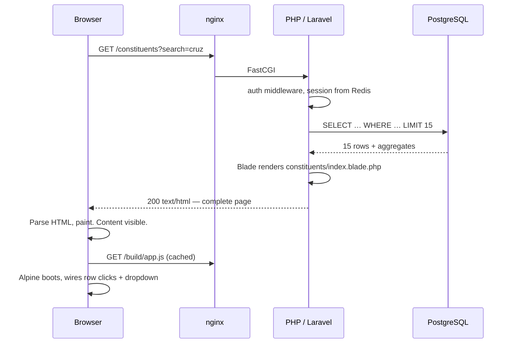
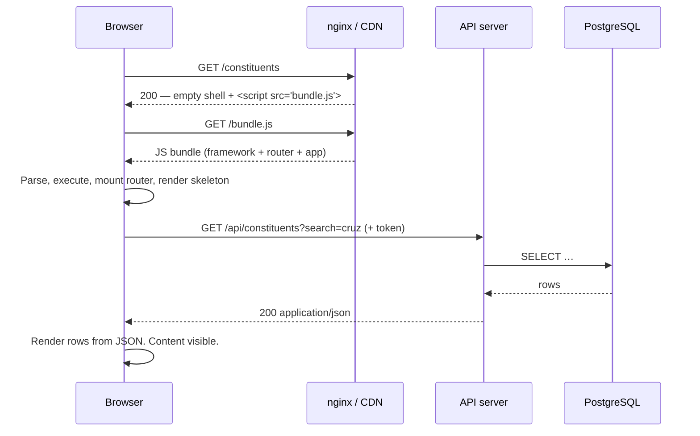

# Server Rendering (this project) vs. a Single-Page App

Reference note for anyone — human or agent — working on this repository. It explains what
architecture this project uses, how the alternative works, and what would actually have to
change to switch.

---

## Contents

- [TL;DR](#tldr)
- [Terminology: three things called "SSR"](#terminology-three-things-called-ssr)
- [What this project is](#what-this-project-is)
- [Request lifecycle: side by side](#request-lifecycle-side-by-side)
- [Where each concern lives](#where-each-concern-lives)
- [Six concrete examples from this codebase](#six-concrete-examples-from-this-codebase)
- [Trade-offs](#trade-offs)
- [What "convert to an SPA" would actually mean here](#what-convert-to-an-spa-would-actually-mean-here)
- [The middle ground](#the-middle-ground)
- [Rules for contributing to this repo](#rules-for-contributing-to-this-repo)

---

## TL;DR

| | This project | An SPA |
|---|---|---|
| Who builds the HTML | PHP, on the server, per request | JavaScript, in the browser, from JSON |
| What the server returns | A complete HTML document | An empty shell + a JS bundle, then JSON |
| Navigation | Full HTTP request, browser replaces the document | JS router swaps components, no document reload |
| Source of truth for UI state | The URL + the server session | JS memory in the browser tab |
| Validation | Server only (`app/Http/Requests/*`) | Client copy for UX + server copy for safety |
| JS on the page | ~1 KB of behaviour (Alpine) | The entire application |

This project renders HTML on the server and ships a small amount of JavaScript for local
interactions. There is **no client-side data fetching anywhere** — grep the repo for
`fetch(`, `axios`, or `XMLHttpRequest` under `resources/` and `app/` and you get zero
matches. Every piece of data reaches the browser already embedded in HTML.

---

## Terminology: three things called "SSR"

The phrase is overloaded. Be precise, because the trade-offs differ:

1. **Classic server rendering / MPA** — server templates produce HTML; the browser is a
   document viewer with sprinkles of JS. Laravel + Blade, Rails + ERB, Django + templates.
   **This is what this project is.**
2. **SSR with hydration** — a JS component tree (React/Vue) is rendered to HTML on the
   server, sent down, then the *same* components boot in the browser and "hydrate" that
   markup to take over. Next.js, Nuxt, SvelteKit. You pay for both a server runtime and a
   full client bundle.
3. **Client-side rendering (CSR) / SPA** — the server sends a near-empty `<div id="app">`
   and a JS bundle; the bundle renders everything and fetches JSON from an API.

"SSR vs. SPA" usually means (1 or 2) vs. (3). When comparing this project to an SPA, the
comparison is **(1) vs. (3)**, which is the sharpest contrast of the three.

---

## What this project is

A classic server-rendered multi-page application, with Alpine.js used only for behaviour
that has no server involvement.

| Layer | Choice | Role |
|---|---|---|
| Routing | `routes/web.php` | Maps URLs to controllers. The URL *is* the app state. |
| Controllers | `app/Http/Controllers/*` | Load data, return a `View` or a `RedirectResponse`. |
| Templates | `resources/views/**/*.blade.php` | Produce the final HTML string. |
| Components | `resources/views/components/**` | Blade components — server-side, compiled to PHP, zero runtime cost in the browser. |
| Client JS | `resources/js/app.js` | Alpine + Chart.js. 37 lines. No routing, no data layer, no state store. |
| Session | Redis (`SESSION_DRIVER=redis`) | Auth identity, flash messages, old input, CSRF token. |

The tell is in the controllers. Every single action returns one of exactly two things:

```php
// app/Http/Controllers/ConstituentController.php:23
public function index(Request $request): View        // → rendered HTML

// app/Http/Controllers/ConstituentController.php:51
public function store(ConstituentRequest $request): RedirectResponse   // → 302, browser re-requests
```

No `JsonResponse`. No API resources. No `/api` routes file. The browser never assembles a
view.

---

## Request lifecycle: side by side

### This project — loading the constituents list



One round trip to visible content. The JS arrives *after* the content and only adds
behaviour — the page is fully readable and navigable without it.

### An SPA — the same screen



Three round trips minimum before first content, and the third cannot start until the
second has downloaded *and executed*. That's the cost of the initial load. The payoff:
every navigation *after* that is one JSON request instead of a full document.

---

## Where each concern lives

| Concern | This project | An SPA |
|---|---|---|
| **Routing** | `routes/web.php`, resolved server-side | Client router (React Router, Vue Router) + a server catch-all rewriting every path to `index.html` |
| **Data access** | Eloquent in `app/Queries/`, `app/Models/` | Same on the server, but wrapped in a JSON serialisation layer |
| **Templating** | Blade → HTML string | JS components → DOM nodes |
| **Auth** | Session cookie, `auth` middleware, session-fixation regeneration on login | Token (JWT / Sanctum) in memory or a cookie, plus refresh handling and guarded client routes |
| **CSRF** | `@csrf` in every form; token in `<meta name="csrf-token">` (`app.blade.php:8`) | `SameSite` cookies + a CSRF header, or bearer tokens (which sidestep CSRF but invite XSS-token-theft) |
| **Validation errors** | `$errors` bag, flashed to the session, redisplayed by `x-form.input` (`input.blade.php:42`) | Rules duplicated client-side for instant feedback; server rules still required — never trust the client |
| **Form repopulation** | `old($name, $value)` — Laravel flashes the previous input (`input.blade.php:31`) | Component state already holds it; nothing to repopulate |
| **Pagination** | `->paginate(15)` + `{{ $constituents->links() }}` renders real `<a href>` links | Page/cursor kept in JS state; links become click handlers; the URL must be synced manually or it breaks sharing and the back button |
| **Flash messages** | `->with('status', …)` read once in `app.blade.php:144` | A toast store in client state; must survive the "navigate then show" sequence yourself |
| **Loading states** | None needed — the browser's own progress indicator | You build every spinner, skeleton, and empty-vs-loading distinction by hand |
| **Error handling** | `resources/views/errors/{404,500}.blade.php` | Per-request `try/catch`, error boundaries, retry logic, offline detection |
| **Back button / deep links** | Free. Every state has a URL because every state *is* a URL. | Requires deliberate History API work; regressions here are the classic SPA bug |

The right-hand column is the real cost of an SPA, and it is not the rendering — it's that
about a dozen things the browser and the framework hand you for free become application
code you own, test, and maintain.

---

## Six concrete examples from this codebase

### 1. Search is a `<form method="GET">`

`resources/views/components/ui/search-form.blade.php:7`

```blade
<form method="GET" action="{{ $action }}">
    <input type="search" name="search" value="{{ $value }}">
```

Submitting navigates to `/constituents?search=cruz`. The server reads it in
`ConstituentController::index` (`:25`), filters, and re-renders. Consequences, all free:
the search is bookmarkable, shareable, survives a refresh, and the back button returns to
the previous search.

In an SPA this is `onChange` → state → debounce → `fetch` → set results → *and* a manual
`history.pushState` so the URL still reflects what's on screen. Same feature; the URL sync
is the part people skip, and then bookmarking silently breaks.

### 2. Deleting is a real form POST

`resources/views/components/ui/delete-button.blade.php`

```blade
<form method="POST" action="{{ $action }}" x-data
      @submit="if (! window.confirm(@js($confirm))) { $event.preventDefault(); }">
    @csrf
    @method('DELETE')
```

Alpine's only job is the confirm dialog. The mutation itself is a plain form submission;
the controller deletes the row and redirects; the browser follows the redirect and gets a
freshly-rendered list. **There is no client cache to invalidate.** That last point is the
quiet advantage — in an SPA, "delete succeeded, now make every list that mentioned this
row agree" is an entire problem domain (hence React Query, SWR, RTK Query).

### 3. Dashboard charts: server computes, client only draws

`DashboardController` (all 19 lines of it) hands `DashboardMetrics::toArray()` to the
view. `resources/views/components/ui/chart.blade.php:9` serialises that array into the
DOM:

```blade
<div x-data="chart(@js(['type' => $type, 'data' => $data, 'options' => $options]))">
    <canvas x-ref="canvas"></canvas>
</div>
```

`resources/js/app.js:18` instantiates Chart.js from that payload. This is the honest
division of labour: **JS does what only JS can do (canvas drawing); the server does
everything else.** All aggregation runs in SQL, arrives with the document, and needs no
extra request. Note the deliberate rule in `app.js:15` — no chart configuration is ever
inlined in a template.

### 4. Validation lives in exactly one place

`app/Http/Requests/ConstituentRequest.php` declares the rules. On failure Laravel
redirects back with errors and old input; `x-form.input` renders both. One definition, no
drift.

An SPA that wants instant feedback needs the same rules in the client too. Two copies of
`max:80` in two languages is a bug waiting to happen — hence the schema-sharing machinery
(Zod + a generator, OpenAPI codegen) that SPA stacks grow.

### 5. Table rows are links, not click handlers

`resources/views/components/ui/row-link.blade.php` makes the whole `<tr>` clickable, but
each cell still contains a genuine `<a href="{{ route('constituents.show', $constituent) }}">`
(`constituents/index.blade.php:37`). Middle-click, ⌘-click, "copy link", and crawlers all
work. The Alpine handler is a convenience layer on top of working HTML — and it
deliberately ignores clicks that land on a real interactive element.

### 6. Active navigation state is computed on the server

`app.blade.php:46` uses `request()->routeIs('dashboard')` inside `@class`. The server knows
which page it is rendering, so the highlight is baked into the HTML. No client router, no
`useLocation()`, no hydration mismatch. Because the sidebar HTML is re-sent on every
navigation, this costs a few hundred bytes per page — the trade an MPA makes.

---

## Trade-offs

### Where this project wins

- **One language, one mental model.** A feature is a route, a controller, a request class,
  and a Blade file. No API contract to negotiate between two codebases.
- **No state synchronisation.** The server's response *is* the state. The largest class of
  SPA bug — stale client cache — cannot occur.
- **Fast first paint, trivially.** Content ships with the document.
- **SEO and link previews work by default.** Irrelevant for this authenticated app, but a
  real factor elsewhere.
- **Security surface is smaller.** No tokens in browser storage, no public JSON API to
  authorise separately, no client-side authorisation logic to bypass. `auth` middleware in
  `web.php:37` is the single boundary.
- **Progressive enhancement.** Kill JS and the app still works, minus confirm dialogs and
  charts. Verifiable: nothing in `resources/js/app.js` is load-bearing for navigation.
- **Cheap accessibility.** Real forms, real links, real focus behaviour. No focus
  management on route change.
- **Testable end to end without a browser.** The eight suites in `tests/Feature/` assert
  on rendered HTML via Pest (`assertSee`, `assertViewHas`, `assertRedirect`) — no
  Playwright, no test-runner-in-a-browser.

### Where an SPA wins

- **Sub-100 ms interactions after load.** No document reparse, no CSS re-application.
- **Rich, stateful UI.** Drag-and-drop, multi-pane editors, canvas tools, optimistic
  updates, undo stacks — anything where UI state is complex, long-lived, and *not*
  meaningfully addressable by a URL.
- **Real-time.** Sockets pushing into an in-memory store is natural in an SPA and awkward
  in an MPA.
- **Offline.** Service worker + local store is possible only when the client owns
  rendering.
- **Multiple front ends.** If iOS/Android also need this data, you're building the JSON API
  regardless — at that point the web SPA reuses it instead of duplicating it.
- **Server cost.** Rendering shifts to user devices; the server does JSON only, so it
  scales cheaper per request. (Weigh this against the extra requests per page.)

### The deciding question

> **Is the UI state meaningfully a URL?**

For this app, yes, every time. "Constituent 412's profile", "page 3 of constituents
matching *cruz*", "the edit form for tax record 8" — each is a URL, and the server can
produce it from scratch in one query. That is precisely the shape server rendering is
built for, and no current feature in `README.md`'s capability table needs anything else.

---

## What "convert to an SPA" would actually mean here

Not a rewrite of the views — a rewrite of the boundary. Honest inventory:

1. **Build a JSON API.** New `routes/api.php`; every controller action returns API
   resources instead of views — 32 public actions across the eight controllers.
2. **Version and document that API.** It's now a public contract with a client you deploy
   separately. Response shapes need OpenAPI or equivalent.
3. **Re-implement auth.** Sanctum tokens or cookie-based SPA auth, plus login/refresh/
   logout flows, plus route guards in the client.
4. **Re-implement all 22 page views** as components, plus the 18 files under
   `resources/views/components/` that currently cost nothing at runtime.
5. **Add a client router** and re-derive every URL that `route()` currently generates.
6. **Add a data layer** — React Query or equivalent — for caching, invalidation, and
   request de-duplication.
7. **Duplicate validation rules** client-side, then keep the two copies in sync forever.
8. **Build every loading, empty, and error state by hand.** `x-ui.empty-state` exists; the
   *loading* state currently doesn't exist because it doesn't need to.
9. **Re-solve pagination, search-in-URL, back-button, and deep-link behaviour** — all of
   which work today because they're plain HTTP.
10. **Add a browser-based test suite.** The Pest feature tests assert on server-rendered
    HTML; they would test the API only, leaving the UI uncovered.

Payoff for a paginated CRUD tool used by barangay staff: navigation drops from roughly one
round trip to roughly one round trip. **Do not do this.** The cost is real and the benefit
is near zero for this workload.

---

## The middle ground

If a specific screen genuinely needs SPA-grade interactivity, there are cheaper options
than an SPA — roughly in order of how little they disturb the current architecture:

| Option | What it does | Cost |
|---|---|---|
| **More Alpine** | Local interactivity with no server involvement (already used: sidebar, dropdown, confirm, charts) | ~0. Reach for this first. |
| **Alpine + `fetch` on one screen** | One endpoint returning JSON or an HTML fragment, one component consuming it | Small, but it's the first crack in "no client data fetching" — do it deliberately, not by accident |
| **HTMX / Turbo** | Server still renders HTML; the client swaps fragments instead of whole documents | Small. Keeps Blade as the single source of truth. |
| **Livewire** | Server-rendered components with a stateful round trip per interaction | Medium. Same language, but a real programming model to learn, and chatty. |
| **Inertia.js** | Vue/React components, no API — controllers pass props directly | Medium-high. Buys the component model, keeps server routing, costs a JS build and full client rendering. |
| **Full SPA** | Separate front end + JSON API | High. See the ten-item list above. |

Rule of thumb: **escalate one row at a time, per screen, and only with a concrete
interaction that the current row genuinely cannot express.** Never for a whole app at once
on the strength of "SPAs feel more modern".

---

## Rules for contributing to this repo

1. **Controllers return `View` or `RedirectResponse`.** If you're about to return JSON to a
   browser view, stop — you're introducing a second architecture.
2. **Data reaches the browser inside the HTML**, either as text or via `@js(...)` for a
   component that needs a payload (`chart.blade.php` is the model).
3. **Validation belongs in `app/Http/Requests/`.** Server-side is not optional and not
   duplicable-for-free.
4. **State that a user could bookmark, share, or reach with the back button belongs in the
   URL**, as a route parameter or query string — see `?search=` and `?page=`.
5. **Alpine handles view-local, server-irrelevant state only**: open/closed, hover,
   confirm dialogs, canvas instances. If a piece of state must survive navigation, it
   belongs in the session or the URL, not in JS.
6. **Links are `<a href>` and mutations are `<form method="POST">`,** with `@csrf` and
   `@method(...)` where needed. Click handlers on non-interactive elements are an
   enhancement on top of working markup, never a replacement for it.
7. **A new dependency in `package.json` needs justification.** The current front end is
   two runtime packages — Alpine and Chart.js — and that is a feature.
